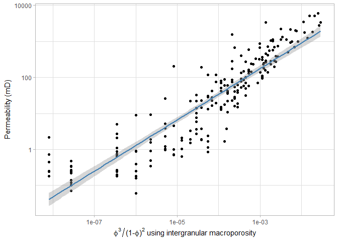
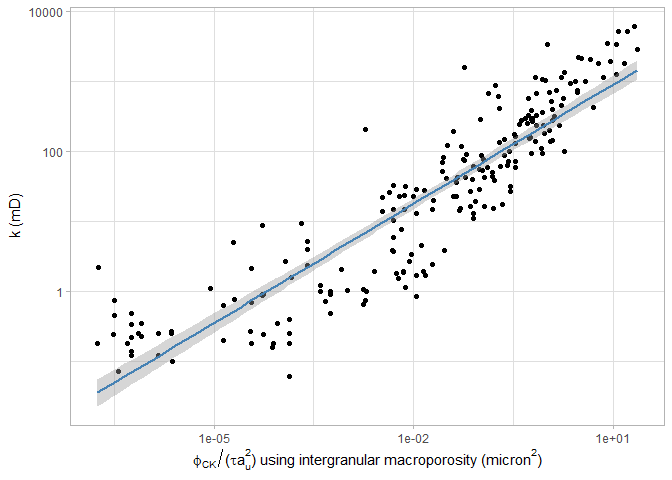
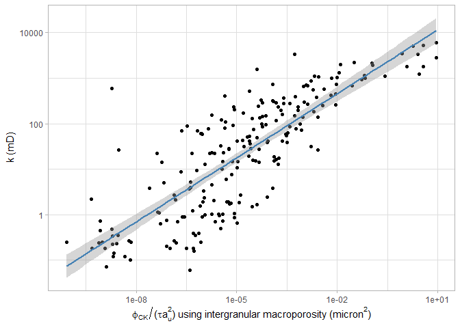
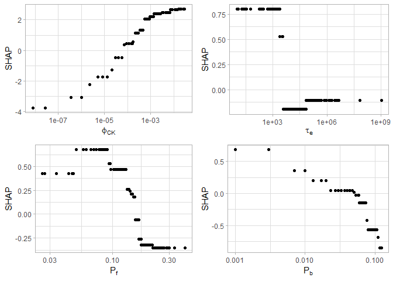

Characterizing cemented sandstones with physics-based and machine
learning approaches
================
Frank Male
28 April 2020

## Introduction

Sandstones one of the most common types of reservoir rocks. Let’s see if
we can explain their permeability.

## Narrative

The most well-known physics-based approach to estimating permeability
was developed by Kozeny (1927) and later modified by Carman (1937). In
its modern form, the equation is written as

  
^2 a^2},
")  

which, for simplicity, we’re going to recast as

  
  

where permeability is
, porosity is
,
tortuosity is
,
the specific surface area is
, and the
Carman-Kozeny void fraction is
. For an uncemented sandstone, tortuosity can be calculated
following the derivation in Appendix B, which comes from Panda and Lake
(1994). For a cemented sandstone, the tortuosity changes because of
cements blocking and forcing modification of the flow paths.

Specific surface area for an uncemented sandstone can be estimated from
the particle size distribution, after assuming that the particles are
spherical. After cementation, the nature of the cement is important in
how the surface area changes. Some cements will coat the walls of the
pores, slightly decreasing the specific surface area. Other cements will
line or bridge the pores, moderately to greatly increasing the specific
surface area.

A competing hypothesis is that pore throat sizes are the most important
determinant of permeability-porosity transforms. This appears in the
Winland relations that follow the form

  
  
  
where  is the
pore throat radius. Pore throat radius might be more impacted by cements
that coat the walls than cements that bridge the pores. Wouldn’t that be
interesting?

Now, because this is a data-driven approach, let’s start by comparing
permeability to the Carman-Kozeny void fraction.

``` r
# readWorksheetFromFile("C:/Users/malef/Dropbox/ROZ/data/GARN1990.xlsx", sheet=1) %>%
#   mutate_at(vars(CD:IMP), ~ as.numeric(.)) %>%
#   mutate(WELL = str_trim(WELL)) %>%
#   mutate(IMP = replace(IMP, IMP==0, 0.01)) %>%
#   select(WELL, KLH, POR, IMP, GS, SO, KAO, ICL, QCM, CAL, DOL) %>%
#   filter_all(any_vars(is.na(.)))


df %>%
  ggplot(aes(x=(IMP/100)^3/(1-(IMP/100))^2, y=KLH)) +
  geom_point() +
  geom_smooth(method="lm", color="steelblue") +
  scale_x_log10(TeX("$\\phi^3/(1-\\phi)^2$ using intergranular macroporosity")) +
  scale_y_log10(TeX("Permeability (mD)"))
```

<!-- -->

``` r
summary(lm(log(KLH) ~ log(CK_void_fraction), data=df))
```

    ## 
    ## Call:
    ## lm(formula = log(KLH) ~ log(CK_void_fraction), data = df)
    ## 
    ## Residuals:
    ##     Min      1Q  Median      3Q     Max 
    ## -3.2600 -0.8124  0.0698  0.7935  3.9761 
    ## 
    ## Coefficients:
    ##                       Estimate Std. Error t value Pr(>|t|)    
    ## (Intercept)           10.08803    0.24257   41.59   <2e-16 ***
    ## log(CK_void_fraction)  0.71222    0.02298   30.99   <2e-16 ***
    ## ---
    ## Signif. codes:  0 '***' 0.001 '**' 0.01 '*' 0.05 '.' 0.1 ' ' 1
    ## 
    ## Residual standard error: 1.261 on 213 degrees of freedom
    ## Multiple R-squared:  0.8185, Adjusted R-squared:  0.8176 
    ## F-statistic: 960.5 on 1 and 213 DF,  p-value: < 2.2e-16

Hey\! That’s pretty good\! The
R is 0.85,
and there are no odd trends. Sure, at low porosity the data resolution
starts to be a problem, but that is at 1/100th of the average
permeability, and “the permeability is bad” is really all you need to
know there. Okay, with that positive result, let’s add the grain size
distribution to the model and see if we can do even better. With the
grain size, we can start talking about the surface area of the pores.
Bird et al. (1960) say that permeability is related to the square of the
pore radius, which is roughly equivalent to the square of the grain
diameter.

``` r
df %>%
  ggplot(aes(x=mean_GS^2 *(IMP/100)^3/(1-(IMP/100))^2, y=KLH)) +
  geom_point() +
  geom_smooth(method="lm", color="steelblue") +
  scale_x_log10(TeX("$D^2\\phi^3/(1-\\phi)^2$ using intergranular macroporosity (micron$^2$)")) +
  scale_y_log10(TeX("$k$ (mD)"))
```

<!-- -->

``` r
#df %>% 
#  mutate(k_pred = mean_GS^2 * CK_void_fraction) %>% 
#  select(k_pred,CK_void_fraction,GS,KLH) %>% 
#  na.omit() %>% 
#  cor(method='spearman')

lm(log(KLH) ~ log(k_pred), data = mutate(df, k_pred = mean_GS^2 * CK_void_fraction)) %>%
  summary()
```

    ## 
    ## Call:
    ## lm(formula = log(KLH) ~ log(k_pred), data = mutate(df, k_pred = mean_GS^2 * 
    ##     CK_void_fraction))
    ## 
    ## Residuals:
    ##     Min      1Q  Median      3Q     Max 
    ## -3.2742 -0.8639  0.0866  0.8664  4.0401 
    ## 
    ## Coefficients:
    ##             Estimate Std. Error t value Pr(>|t|)    
    ## (Intercept)  1.45598    0.10427   13.96   <2e-16 ***
    ## log(k_pred)  0.69914    0.02359   29.64   <2e-16 ***
    ## ---
    ## Signif. codes:  0 '***' 0.001 '**' 0.01 '*' 0.05 '.' 0.1 ' ' 1
    ## 
    ## Residual standard error: 1.307 on 213 degrees of freedom
    ## Multiple R-squared:  0.8048, Adjusted R-squared:  0.8039 
    ## F-statistic: 878.5 on 1 and 213 DF,  p-value: < 2.2e-16

Well, our Pearson correlation coefficent has gone down to 0.64. Nuts.
Well, it’s pretty hard to estimate the mean grain size from looking at
Beard and Weyl’s comparators, so I can understand that. Or… how
well-sorted are these grains? Not that well-sorted? Then let’s do a
specific surface area that takes that into account, with Panda and
Lake’s derivation.

``` r
df %>%
  ggplot(aes(x=CK_void_fraction/a_u^2, y=KLH)) +
  geom_point() +
  geom_smooth(method="lm", color="steelblue") +
  scale_x_log10(TeX("$\\phi_{CK}/a_u^2$ using intergranular macroporosity (micron$^2$)")) +
  scale_y_log10(TeX("$k$ (mD)"))
```

<!-- -->

``` r
# df %>% 
#   mutate(k_pred = a_u * CK_void_fraction) %>% 
#   select(k_pred, CK_void_fraction, GS, a_u, KLH) %>% 
#   na.omit() %>% 
#   cor(method='spearman')

lm(log(KLH) ~ log(k_pred), data = mutate(df, k_pred = CK_void_fraction/a_u^2)) %>%
  summary()
```

    ## 
    ## Call:
    ## lm(formula = log(KLH) ~ log(k_pred), data = mutate(df, k_pred = CK_void_fraction/a_u^2))
    ## 
    ## Residuals:
    ##     Min      1Q  Median      3Q     Max 
    ## -3.2742 -0.8639  0.0866  0.8664  4.0401 
    ## 
    ## Coefficients:
    ##             Estimate Std. Error t value Pr(>|t|)    
    ## (Intercept)  3.96136    0.09422   42.05   <2e-16 ***
    ## log(k_pred)  0.69914    0.02359   29.64   <2e-16 ***
    ## ---
    ## Signif. codes:  0 '***' 0.001 '**' 0.01 '*' 0.05 '.' 0.1 ' ' 1
    ## 
    ## Residual standard error: 1.307 on 213 degrees of freedom
    ## Multiple R-squared:  0.8048, Adjusted R-squared:  0.8039 
    ## F-statistic: 878.5 on 1 and 213 DF,  p-value: < 2.2e-16

Okay, so that’s not helping the regression. It looks like Carman-Kozeny
void fraction is our best main predictor.

Maybe adding the uncemented tortuosity will help. Maybe both tortuosity
and the specific surface area are needed. Let’s throw it all together,
then make a Spearman correlation table as well, for good measure.

``` r
df %>%
  ggplot(aes(x = CK_void_fraction / (tau_o * a_u^2), y=KLH)) +
  geom_point() +
  geom_smooth(method="lm", color="steelblue") +
  scale_x_log10(TeX("$\\phi_{CK} / (\\tau a_u^2)$ using intergranular macroporosity (micron$^2$)")) +
  scale_y_log10(TeX("$k$ (mD)"))
```

<!-- -->

``` r
# df %>% mutate(k_pred = CK_void_fraction / (tau_o * a_u^2)) %>% 
#   select(CK_void_fraction,tau_o, a_u, k_pred,KLH) %>% 
#   na.omit() %>% 
#   cor(method="spearman") 

lm(log(KLH) ~ log(k_pred), data = mutate(df, k_pred = CK_void_fraction/(tau_o * a_u^2))) %>%
  summary()
```

    ## 
    ## Call:
    ## lm(formula = log(KLH) ~ log(k_pred), data = mutate(df, k_pred = CK_void_fraction/(tau_o * 
    ##     a_u^2)))
    ## 
    ## Residuals:
    ##     Min      1Q  Median      3Q     Max 
    ## -3.2216 -0.8336  0.0901  0.7968  4.0756 
    ## 
    ## Coefficients:
    ##             Estimate Std. Error t value Pr(>|t|)    
    ## (Intercept)   5.2586     0.1138   46.19   <2e-16 ***
    ## log(k_pred)   0.5662     0.0187   30.28   <2e-16 ***
    ## ---
    ## Signif. codes:  0 '***' 0.001 '**' 0.01 '*' 0.05 '.' 0.1 ' ' 1
    ## 
    ## Residual standard error: 1.285 on 213 degrees of freedom
    ## Multiple R-squared:  0.8115, Adjusted R-squared:  0.8106 
    ## F-statistic: 916.7 on 1 and 213 DF,  p-value: < 2.2e-16

Okay, well, the original (pre-compaction) tortuosity is helping things.
Of course, it is a function of porosity, so really we’re just building
more complicated models for explaining porosity’s effect on
permeability. Also, this isn’t really better than just using the
Carman-Kozeny void fraction. With that in mind, let’s look at tortuosity
after taking the variable grain sizes into account.

``` r
df %>%
  ggplot(aes(x = CK_void_fraction / (tau_u * a_u^2), y=KLH)) +
  geom_point() +
  geom_smooth(method="lm", color="steelblue") +
  scale_x_log10(TeX("$\\phi_{CK} / (\\tau a_u^2)$ using intergranular macroporosity (micron$^2$)")) +
  scale_y_log10(TeX("$k$ (mD)"))
```

<!-- -->

``` r
# df %>% mutate(k_pred = a_u * CK_void_fraction / tau_u) %>%
#   select(CK_void_fraction,tau_u, a_u ,k_pred,KLH) %>%
#   na.omit() %>%
#   cor(method="spearman") # %>% #tapply( function(x) x^2)

lm(log(KLH) ~ log(k_pred), data = mutate(df, k_pred = CK_void_fraction/(tau_u * a_u^2))) %>%
  summary()
```

    ## 
    ## Call:
    ## lm(formula = log(KLH) ~ log(k_pred), data = mutate(df, k_pred = CK_void_fraction/(tau_u * 
    ##     a_u^2)))
    ## 
    ## Residuals:
    ##     Min      1Q  Median      3Q     Max 
    ## -3.2422 -0.8158  0.1023  0.8130  4.1139 
    ## 
    ## Coefficients:
    ##             Estimate Std. Error t value Pr(>|t|)    
    ## (Intercept)   5.4844     0.1179   46.52   <2e-16 ***
    ## log(k_pred)   0.5676     0.0186   30.52   <2e-16 ***
    ## ---
    ## Signif. codes:  0 '***' 0.001 '**' 0.01 '*' 0.05 '.' 0.1 ' ' 1
    ## 
    ## Residual standard error: 1.277 on 213 degrees of freedom
    ## Multiple R-squared:  0.8139, Adjusted R-squared:  0.813 
    ## F-statistic: 931.6 on 1 and 213 DF,  p-value: < 2.2e-16

And that helps a bit, but it still isn’t as good as just using
. But wait, there’s more\! Cementation should matter. Let’s
try the cemented measure of tortuosity. That ought to get us somewhere.

``` r
df %>%
  ggplot(aes(x=CK_void_fraction / (tau_e * a_u^2), y=KLH)) +
  geom_point() +
  geom_smooth(method="lm", color="steelblue") +
  scale_x_log10(TeX("$\\phi_{CK} / (\\tau a_u^2)$ using intergranular macroporosity (micron$^2$)")) +
  scale_y_log10(TeX("$k$ (mD)"))
```

<!-- -->

``` r
# df %>% mutate(k_pred = CK_void_fraction / (tau_e * a_u^2)) %>% 
#   select(CK_void_fraction,tau_e, a_u ,k_pred,KLH) %>% 
#   na.omit() %>% 
#   cor(method="spearman")

lm(log(KLH) ~ log(k_pred), data = mutate(df, k_pred = CK_void_fraction/(tau_e * a_u^2))) %>%
  summary()
```

    ## 
    ## Call:
    ## lm(formula = log(KLH) ~ log(k_pred), data = mutate(df, k_pred = CK_void_fraction/(tau_e * 
    ##     a_u^2)))
    ## 
    ## Residuals:
    ##     Min      1Q  Median      3Q     Max 
    ## -4.1900 -1.1330 -0.0377  1.0642  7.5452 
    ## 
    ## Coefficients:
    ##             Estimate Std. Error t value Pr(>|t|)    
    ## (Intercept)  8.28334    0.27783   29.81   <2e-16 ***
    ## log(k_pred)  0.46949    0.02267   20.71   <2e-16 ***
    ## ---
    ## Signif. codes:  0 '***' 0.001 '**' 0.01 '*' 0.05 '.' 0.1 ' ' 1
    ## 
    ## Residual standard error: 1.705 on 213 degrees of freedom
    ## Multiple R-squared:  0.6681, Adjusted R-squared:  0.6665 
    ## F-statistic: 428.7 on 1 and 213 DF,  p-value: < 2.2e-16

Oops, switching to effective tortuosity hurts the fit. Okay then, let’s
add effective surface area. But how? The effective surface area has
fitting parameters that we don’t know a priori — the effects of pore
lining, bridging, and filling cement on the specific surface area. So,
what do we do? Well, let’s start by looking at cement volume versus
permeability. Then, let’s look at the Spearman correlation matrices
between these cements and permeability.

``` r
ggarrange(
df %>%
  ggplot(aes(P_b, KLH)) +
  geom_point() +
  stat_smooth() +
  scale_y_log10(breaks = c(1,10,100,1000,10000)) +
  labs(x="Fraction pore bridging cement", y="Permeability (mD)")
,
df %>%
  ggplot(aes(P_f, KLH)) +
  geom_point() +
  stat_smooth() +
  scale_y_log10(breaks = c(1,10,100,1000,10000)) +
  labs(x="Fraction pore filling cement", y="Permeability (mD)")
,
nrow = 1, ncol=2, labels="auto")
```

    ## `geom_smooth()` using method = 'loess' and formula 'y ~ x'
    ## `geom_smooth()` using method = 'loess' and formula 'y ~ x'

<!-- -->

``` r
df %>% 
  select(CK_void_fraction, P_b, P_f, KLH) %>% 
  na.omit() %>% 
  cor(method="spearman")
```

    ##                  CK_void_fraction        P_b        P_f        KLH
    ## CK_void_fraction        1.0000000 -0.4197979 -0.5868664  0.9308890
    ## P_b                    -0.4197979  1.0000000  0.1151770 -0.4736764
    ## P_f                    -0.5868664  0.1151770  1.0000000 -0.6095451
    ## KLH                     0.9308890 -0.4736764 -0.6095451  1.0000000

Ah ha\! This matters. Nice, high, Spearman r values showing that
pore-filling and pore-bridging cement are bad for permeability. Now,
these also happen to be strongly correlated with interparticle porosity
and, as one might expect, so the story could be complicated, there. This
looks like enough to start setting up a regression. What form should
this regression take? Let’s take some inspiration from Winland and
slightly abuse Panda and Lake’s (1995) Carman-Kozeny equation.

After that abuse, the regression equation becomes

  
  

Now, to the regressor\!

``` r
model_cement <- lm( log(KLH) ~ log(CK_void_fraction) + log(P_b) + log(P_f) + log(a_u) + log(tau_e), data = df, na.action=na.exclude) 

#summary(df[, c("CK_void_fraction","P_b","P_f","a_u")])
summary(model_cement)
```

    ## 
    ## Call:
    ## lm(formula = log(KLH) ~ log(CK_void_fraction) + log(P_b) + log(P_f) + 
    ##     log(a_u) + log(tau_e), data = df, na.action = na.exclude)
    ## 
    ## Residuals:
    ##     Min      1Q  Median      3Q     Max 
    ## -3.1513 -0.8064  0.0719  0.7716  3.8951 
    ## 
    ## Coefficients:
    ##                       Estimate Std. Error t value Pr(>|t|)    
    ## (Intercept)            5.01954    1.07582   4.666 5.49e-06 ***
    ## log(CK_void_fraction)  0.62982    0.02597  24.255  < 2e-16 ***
    ## log(P_b)              -0.46819    0.10312  -4.540 9.48e-06 ***
    ## log(P_f)              -0.77252    0.21598  -3.577 0.000432 ***
    ## log(a_u)              -0.11392    0.22681  -0.502 0.616002    
    ## log(tau_e)             0.07359    0.03829   1.922 0.055987 .  
    ## ---
    ## Signif. codes:  0 '***' 0.001 '**' 0.01 '*' 0.05 '.' 0.1 ' ' 1
    ## 
    ## Residual standard error: 1.157 on 209 degrees of freedom
    ## Multiple R-squared:  0.8499, Adjusted R-squared:  0.8463 
    ## F-statistic: 236.7 on 5 and 209 DF,  p-value: < 2.2e-16

``` r
postResample(predict(model_cement,df), log(df$KLH))
```

    ##      RMSE  Rsquared       MAE 
    ## 1.1410837 0.8499225 0.8866148

``` r
df %>%
  mutate(k_pred = exp(predict(model_cement,.))) %>%
  ggplot(aes(x = k_pred, y = KLH)) + 
  geom_point() +
  geom_abline(slope=1,intercept=0) +
  #geom_smooth(method="lm") +
  scale_x_log10() +
  scale_y_log10() +
  labs(x="Predicted permeability from Winland-style model (mD)", y = "Measured permeability (mD)")
```

<!-- -->

Now we’re cooking with gas\! An
R of 0.87
is nothing to sneeze at. Also, it’s the first time we’ve improved beyond
the straight Carman-Kozeny void fraction relation. The one issue is that
this assumes a linear relationship between the cementation of various
types and the porosity. The solution here is to go to non-parametric
fitting. Now, non-parametric fitting is prone to overfitting, so we’re
going to have to set up some cross-validation. After that, let’s perform
some recursive feature elimination to figure out which features are
really impacting permeability. Then, let’s use a gradient boosting
regressor on the significant features.

``` r
# fit_control <- trainControl(index = groupKFold(df$WELL))
# rf_grid <- expand.grid(mtry = c(2,3,4,5),
#                        min.node.size = c(4,5,6,7),
#                        splitrule = "maxstat"
# )
# 
#              
# fit_rf<- train(
#   log(KLH) ~ CK_void_fraction + P_b + P_f + a_u + tau_e,
#   data = df,
#   method = 'ranger',
#   trControl = fit_control,
#   tuneGrid = rf_grid
# )
#
# ggplot(fit_rf,plotType = "scatter", output="layered", highlight = TRUE)

fit_ctr_rfe <- rfeControl(functions = rfFuncs,
                          index = groupKFold(df$WELL)
                          )


rf_profile <- rfe(
  log(KLH) ~ CK_void_fraction + P_b + P_f + a_u + tau_e,
  data = df,
  rfeControl = fit_ctr_rfe
)

#arrange(df, df$IMP)

print(paste("The predictors are:", paste(predictors(rf_profile), collapse = ", ")))
```

    ## [1] "The predictors are: CK_void_fraction, tau_e, P_f, P_b"

This is not a terribly surprising result. Now, to the gradient boosting
regressor to see how it all comes together.

``` r
cl <- makePSOCKcluster(12)
registerDoParallel(cl)

fit_control <- trainControl(index = groupKFold(df$WELL),
                            allowParallel = TRUE)
# xgb_grid <- expand.grid(nrounds = seq(20, 200, by=10),
#                        max_depth = 1, #c(1,2,3),
#                        eta = seq(.01,.16, by=.01),
#                        gamma = 0.55, #seq(0.4, 0.6, by = 0.05), #c(0, 0.05, 0.1, 0.5, 0.7, 0.9, 1.0),
#                        colsample_bytree = 0.8, #seq(0.4, 1.0, by=0.2),
#                        min_child_weight = 6, #c(5,6,7),
#                        subsample = 1#c(0.5,0.75,1.0)
#                        )
# 
# fit_xgboost <- train(
#   log(KLH) ~ CK_void_fraction + tau_e + P_b + P_f,
#   data = df,
#   method = 'xgbTree',
#   trControl = fit_control,
#   tuneGrid = xgb_grid
# )
# 
# ggplot(fit_xgboost,plotType = "scatter", output="layered", highlight = TRUE)
# fit_xgboost$bestTune

final_grid <- expand.grid(
  nrounds = 150,
  max_depth = 1,
  eta = 0.07,
  gamma = 0.55,
  colsample_bytree = 0.8,
  min_child_weight = 6,
  subsample = 1
)

fit_xgboost <- train(
  log(KLH) ~ CK_void_fraction + tau_e + P_b + P_f,
  data = df,
  method = 'xgbTree',
  trControl = fit_control,
  tuneGrid = final_grid
)

df %>%
  mutate(k_pred = exp(predict(fit_xgboost,.))) %>%
  ggplot(aes(x = k_pred, y = KLH)) + 
  geom_point() +
  geom_abline(slope=1,intercept=0) +
  #geom_smooth(method="lm") +
  scale_x_log10() +
  scale_y_log10() +
  labs(x="Predicted permeability from gradient boosting (mD)", y = "Measured permeability (mD)")
```

<!-- -->

``` r
postResample(log( predict(fit_xgboost, df)), log(df$KLH))
```

    ##      RMSE  Rsquared       MAE 
    ## 3.3626574 0.7301831 2.9247083

``` r
postResample(log( predict(fit_xgboost, df_holdout)), log(df_holdout$KLH))
```

    ##      RMSE  Rsquared       MAE 
    ## 5.2617136 0.5800722 4.9913699

``` r
#cor(log( predict(fit_xgboost, df_holdout)), log(df_holdout$KLH))
```

And now, the variable importances:

``` r
library(xgboost)
```

    ## 
    ## Attaching package: 'xgboost'

    ## The following object is masked from 'package:dplyr':
    ## 
    ##     slice

``` r
predictor = Predictor$new(fit_xgboost, data = select(df, CK_void_fraction, tau_e, P_b, P_f), y = log(df$KLH))
imp = FeatureImp$new(predictor, loss = "rmse", n.repetitions = 40)
plot(imp) +
  scale_x_continuous("Feature importance (RMSE without feature / RMSE)") +
  geom_vline(xintercept = 1.0)
```

    ## Scale for 'x' is already present. Adding another scale for 'x', which
    ## will replace the existing scale.

<!-- -->

``` r
shaps <- xgb.plot.shap(as.matrix(select(df, CK_void_fraction, tau_e, P_b, P_f)), 
                       model=fit_xgboost$finalModel, 
                       top_n=4, n_col=2, pch="o")
```

<!-- -->

``` r
data <- merge(melt(shaps$shap_contrib, value.name="SHAP"),
              melt(shaps$data, value.name="Value")
) 

#data


# data <- merge(melt(shaps$shap_contrib, value.name="SHAP"),
#               melt(shaps$data, value.name="Value")
# ) %>%
#   merge(df_name, by.x = "Var2", by.y ="Var1")
# explan_order <- data %>% 
#   dplyr::group_by(explanation) %>% 
#   summarise(max=max(abs(SHAP))) %>% 
#   arrange(max)
# data$explanation <- factor(data$explanation, levels=explan_order$explanation)


ggplot(data,aes(x=SHAP,y=Var2, color=Value)) +
  geom_jitter() +
  #scale_color_distiller(palette="Reds") +
  scale_color_viridis_c(option="plasma") +
  labs(x="SHAP value", y="Feature")
```

<!-- -->

``` r
# ggsave(paste0(figdir,"shapley_plot_XGB.png"),height=3,width=8)

# data %>%
#   filter(explanation %in% explan_order$explanation[5:8]) %>%
#   mutate(explanation = factor(explanation, levels=explan_order$explanation[8:5])) %>%
#   ggplot(aes(x=Value, y=SHAP)) +
#   facet_wrap(~explanation, scales="free_x",ncol=2) +
#   geom_point(color="peru")
# ggsave(paste0(figdir,"SHAP_byvalue.png"), width=6.1,height=4)

ggarrange(
ggplot(filter(data, Var2=="CK_void_fraction"), aes(x=Value, y = SHAP)) +
  geom_point() +
  scale_x_log10() +
  labs(x = TeX("$\\phi_{CK}"))
,
ggplot(filter(data, Var2=="tau_e"), aes(x=Value, y = SHAP)) +
  geom_point() +
  scale_x_log10() +
  labs(x = TeX("$\\tau_e"))
,
ggplot(filter(data, Var2=="P_f"), aes(x=Value, y = SHAP)) +
  geom_point() +
  scale_x_log10() +
  labs(x = TeX("$P_f"))
,
ggplot(filter(data, Var2=="P_b"), aes(x=Value, y = SHAP)) +
  geom_point() +
  scale_x_log10() +
  labs(x = TeX("$P_b$"))
,
nrow = 2, ncol = 2)
```

<!-- -->

Interesting results, yes?

See the paper for the exciting conclusion\!
