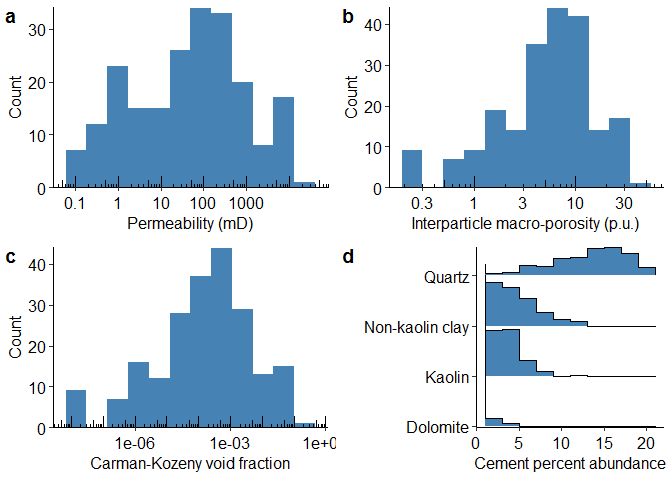
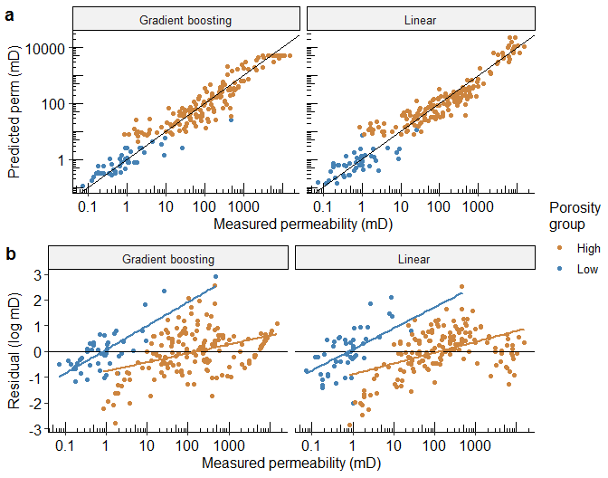
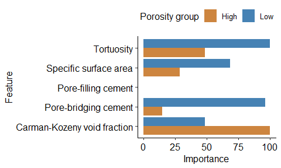

Comparison of permeability predictions on cemented sandstones with
physics-based and machine learning approaches
================
Frank Male, Jerry L. Jensen, Larry W. Lake
29 April 2020

# Abstract

Permeability prediction has been an important problem since the time of
Darcy. Most approaches to solve this problem have used either idealized
physical models or empirical relations. In recent years, machine
learning (ML) has led to more accurate and robust, but less
interpretable empirical models. Using 211 core samples collected from 12
wells in the Garn Sandstone from the North Sea, we compared idealized
physical models based on the Carman-Kozeny equation to interpretable ML
models. We found that ML models trained on estimates of physical
properties are more accurate than physical models. Also, we found
evidence of a threshold of about 10% volume fraction, above which
pore-filling cement strongly affects permeability.

# Introduction

Sandstone is one of the most common types of reservoir rocks,
contributing approximately 30% to the stratigraphic total of sedimentary
rocks (Pettijohn, 1975) and containing about 50% of the world’s
hydrocarbon reserves. Therefore, it is of interest to predict the
reservoir properties of sandstones. This paper will focus on analyzing
the factors that influence sandstone permeability.

At least two broad approaches are available for permeability prediction
of sandstones: 1) physics-based models, such as the Carman-Kozeny
equation and its derivatives, and 2) empirical models, developed using
statistical or machine learning (ML) tools that assume no particular
physical laws linking predictors and permeability. There are several
physics-based and empirical models; Dullien (2012) gives a good review
of both model types. We will apply a hybrid approach that considers both
the physical intuition encapsulated in the Carman-Kozeny equation and
data-centric models. The novelty of our work is that it compares the
results of the physics-only and physics plus data driven models.

Kozeny (1927) and Carman (1937) developed an equation linking
permeability to three factors: porosity, hydraulic tortuosity, and
specific surface area. Porosity and permeability are routinely measured
during core analysis, but hydraulic tortuosity (as opposed to electrical
tortuosity) and specific surface area are rarely evaluated although some
log-derived quantities are surrogates for this. However, both tortuosity
and specific surface area arise from geologic processes that can be
modeled and distributed throughout the reservoir. Therefore,
understanding the magnitude and effect of tortuosity and surface area
can aid in building accurate permeability predictors and applying these
predictions in geomodels.

Panda and Lake (1995) developed a mathematical framework for estimating
tortuosity and specific surface area for real rocks that had undergone
diagenesis. The framework, can predict permeability from the
intergranular porosity, the average grain diameter, the grain size
distribution, and the amounts and types of various cements.

Machine learning can be used to understand how useful tortuosity and
specific surface area are for predicting permeability. With advanced
non-parametric ML (such as the gradient boosting machine developed by
Friedman, 2001), there is no requirement to assume *a priori* a
functional form between these variables and the predicted quantity. With
the recent derivation of a consistent feature attribution system for
explaining tree-based models (Lundberg et al., 2018), the functional
form can be visualized after modeling; this may help petrophysicists to
understand the mechanisms controlling permeability.

In this study, we develop estimates for the permeability of the Garn
Sandstone reservoir (Ehrenberg, 1990), using the data from the 12 wells
in that study. The Garn is a Middle Jurassic formation in the North Sea,
in the Haltenbanken area (Ehrenberg, 1990) that was deposited in fluvial
and near-shore marine environments (Gjelberg et al., 1987). It is
composed mostly of quartz grains and secondarily with feldspar
(Ehrenberg, 1990). We compare different methods for calculating the
tortuosity and specific surface area from core description, and we find
the most important determinants of permeability predictors for this
data. Our analysis shows that porosity best predicts permeability,
followed by the presence of pore bridging cement and then tortuosity.
Given the physics-based model and advanced ML estimators, we propose a
hybrid approach, combining the best qualities of each method.

# Methods

## Physical models

Perhaps the best-known physics-based relationship to estimate
permeability was developed by Kozeny (1927) and later modified by Carman
(1937). In its modern form, the equation is written as   
^2 a^2},")  
which, for simplicity, we will write as   
  
where permeability is
, porosity is
,
tortuosity is
,
the specific surface area (wetted area/volume) is
, and the
Carman-Kozeny void fraction is
. For an uncemented sandstone, tortuosity can be calculated
following the derivation in Appendix A, which comes from Panda and Lake
(1994). For a cemented sandstone (Appendix B), the tortuosity changes
because of cements blocking and forcing modification of the flow paths.

For monodisperse spheres,
, where  is the sphere diameter. For uncemented spheres of more than one
size,  can be
estimated from the particle size distribution (sorting) (Panda and Lake,
1994). After cementation, the cement distribution is a further control
on how the surface area changes. Some cements will coat the pores walls,
slightly decreasing the specific surface area. Other cements will line
or bridge the pores, moderately to greatly increasing the specific
surface area.

A different model is based on the idea that pore throat sizes are an
important variable in permeability models. This hypothesis is implicit
in the Winland-style relations that follow the form   
  

where  is the
pore throat radius (see Kolodzie, 1980; Di and Jensen, 2015).
<!--Winland’s work focused on predicting pore throat radius (and therefore two-phase fluid flow properties) from permeability and porosity but, a several investigators have reversed the roles of the predictor and response variables in the equation to predict permeability from pore throat size and porosity (e.g., Ghanbarian et al., 2019; Ngo et al., 2015; and Comisky et al., 2007).  -->

Doyen (1988) formalized this approach, applying effective medium theory
to explain permeability with the equation  
  
  
where
 is the effective pore throat radius and  is the spatial average of the square of the
pore channel radii. This result is remarkably similar to the
Carman-Kozeny equation, except that the dependency on specific surface
area has been replaced with a dependency on the pore throat radii.

As a practical consideration, the pore throat radius might be more
impacted by cements that coat the walls than cements that bridge the
pores. However, the opposite is true for the specific surface area
(Scheidegger, 1960).

## Data-driven models

Empirical models have long been important in reservoir engineering (see
Frick, 1962 for numerous examples). These models, such as Winland’s
equation (Kolodzie, 1980), seek out relationships between predictor
variables (independent variables) and responses (dependent variables –
here, permeability). In the last two decades, advances in applied
statistics and computing power have created new approaches for
developing empirical relationships. This has spawned the field of data
analytics and the attendant study of ML.

The data analytics approach is as follows:  
1\. collect and clean data  
2\. propose physics-based predictor variables  
3\. perform exploratory analysis  
4\. build machine learning models on a subset of the data (training
data)  
5\. evaluate the machine learning models on new data (testing data)  
6\. interpret model results.

We apply the above workflow to data from Ehrenberg (1990). We chose this
dataset because it has a large range of permeability and porosity,
cement proportions are measured, and it requires only minimal cleaning.
However, lacks many of the variables in the Carman-Kozeny equation.
Therefore, we performed feature engineering to derive these variables
from Ehrenberg’s measurements. Among the variables we did not have were
the mean particle size, the coefficient of variation of the particle
size, and the skewness of the particle size distribution. These
variables were derived through the procedure given in Appendix C.

During exploratory data analysis, we plot the distributions of predictor
and response variables and make cross-plots between variable pairs to
identify predictor variables with strong co-linearity and with strong
correlation to the response variable. For the Garn sandstone, the
predictor variables include the porosity, the Carman-Kozeny void
fraction, the Carman-Kozeny predictions of permeability, and the volume
fractions of pore-filling and pore-bridging cement present.

Ehrenberg (1990) estimated porosity two ways: Helium porosimetry, and
point counting the intergranular macroporosity of thin sections. These
measurements are highly correlated, so including both in the regression
model could cause overfitting and overestimate the influence of porosity
on the permeability (feature importance would be split between the two
porosity measures). Therefore, we chose to use a single porosity
estimate. Exploratory data analysis showed that intergranular
macroporosity was a better predictor of permeability than Helium
porosity, and we chose it for the model.

We used two approaches to build the models: multiple linear regression
and gradient boosting regression (Friedman, 2001). Multiple linear
regressions are common, easily interpretable, and robust to overfitting.
These regressions also make several assumptions that are often violated
in real data sets, including a linear model relating predictors and
response variables, Gaussian distributions, and homoscedastic residuals.
Gradient boosting regressors make fewer assumptions about the
distributions of the input data and the character of the relationship
between predictor variables and the response, but their results are
difficult to interpret and prone to overfitting. To illustrate the
benefits and drawbacks of these approaches, we use both methods and
compare the results.

Through careful feature selection and pre-processing, we limited the
degree to which the assumptions in linear regression are violated. As
aforementioned, one of those steps is removing highly correlated
predictor variables. In addition, we log-transformed the predictor
variables and permeability, which reduces non-normality of the
variables’ distributions. Log-transformation also makes the
correlations between variables more linear. Using the Box-Cox (1964)
transformation did not significantly improve the results, but it can be
effective in some cases, as shown by Jensen et al. (1987).)

We evaluated the models through calculating the model explained variance
(R<sup>2</sup>), mean absolute error (MAE), and root-mean squared error
(RMSE). The equations for these measures are as follows  
<!--$$\begin{align}-->   
  

  
^2 \\right)^{1/2}")  

  
  
<!--\end{align}$$--> where
 is the sample
size 
represents the sample number,
 is the actual
value,  is
the predicted value, a bar over a quantity is the sample mean of that
quantity, and
 is the sample standard deviation of a quantity.

Hyperparameters for the gradient boosting regressor were selected
through cross-validation. During cross-validation, candidate models are
fed data on seven of the eight wells in the training data, then scored
based on which minimizes the RMSE predicting the excluded well. This is
iterated through each well and a gamut of hyperparameters. Through this
procedure, we maximize the model effectiveness while reducing
overfitting by minimizing the validation RMSE on held-out data (four
wells in the testing data).

In order to determine whether predictor variables contributed to the
result, we used a non-parametric approach. This approach is called
Permutation Feature Importance (Fisher, et al., 2018), and estimates the
importance of a predictor variable based on how much the model error
increases after that variable is permutated (randomly shuffled).

Linear models can be interpreted simply through examining the weight
assigned to each predictor (feature). Gradient boosting methods require
a different approach. SHapley Additive exPlanations (SHAP values) offer
a way to explain how each predictor variable contributed to each
prediction (Lundberg and Lee, 2016). The idea behind Shapley values is
to determine how much each input affects the output for each individual
prediction. To do this, SHAP values use an idea borrowed from
cooperative game theory (Shapley, 1953), where the actors work together
as a team to achieve a result, leading to a pay-out proportional to how
much each actor contributed to the final result. We use an exact
solution for SHAP values (Lundberg and Lee, 2016) that has been
implemented in the XGBoost library (Chen and Guestrin, 2016).

# Results

## Exploratory analysis

First, we examined the distributions for porosity, permeability,
Carman-Kozeny void fraction, and the proportion of various cements (Fig.
1). The permeability, porosity—and therefore Carman-Kozeny void
fraction—distributions follow a bi-modal distribution. The
permeability histogram is the most clearly bi-modal (modes of
approximately 0.8 and 90 md) of the three parameters, but a minor mode
also exists in the porosity histograms ( modes at approximately 1.8 and 6 pu). Multimodal
distributions are common in subsurface data and can be indicative of
multiple facies (Jensen et al., 2000). An appropriate treatment of
bi-modal data is to analyze each mode separately, splitting the analysis
into high porosity and low porosity assessments.

Therefore, when we performed regressions on the data, we treated each
mode separately, rather than regressing across the entirety of the data.
The data was split into two classes: samples where the interparticle
macro-porosity is greater than 2.3% (high) or less than or equal to 2.3%
(low). The cutoff was selected through using Gaussian Mixture Modeling
(Fraley and Raftery, 2002) to separate the modes..

There are 163 points in the high porosity training set, 41 points in the
high porosity testing set, 48 points in the low porosity training set,
and 20 points in the low porosity testing set.

<!-- -->

Figure 1. Histograms for the distributions of a) Klinkenberg-corrected
absolute permeability b) interparticle macro-porosity from
point-counting c) Carman-Kozeny void fraction from macro-porosity d)
Percent abundances (total area fraction) of cement. The permeability and
porosity, both log-transformed, follow bimodal distributions. Quartz is
the most abundant cement, followed by non-kaolin clay (smectite and
illite).

Next, we cross-plotted permeability against several individual
predictors (Fig. 2): Carman-Kozeny void fraction, tortuosity,
pre-cementation specific surface area, and fraction of pore-bridging and
pore-filling cement. Pore-filling cement includes quartz, kaolin clay,
and dolomite, and pore-bridging cement is non-kaolin clay.  
<!-- -->

Figure 2. Cross-plots between permeability and several predictor
variables. These variables include a) the interparticle macro-porosity
b) the Carman-Kozeny void fraction, c) tortuosity as calculated in Panda
and Lake (1995), d) specific surface area in reciprocal square microns
for the grains (pre-cementation), e) fraction of pore-bridging cement f)
fraction of pore-filling cement. The color indicates whether the sample
has greater than 2.3 percent porosity (orange) or not (blue).

To assign values to the correspondence between the predictor variables
and permeability, we calculated the Pearson’s r and Kendall tau values
(Table 1). Both statistics measure the degree of association between the
variables and have values between -1 and 1. Pearson’s statistic is a
measure of linear correlation and based on the data values; Kendall’s
statistic is based on the ranks of the data values. More details can be
found in many statistics texts, including Miller (1986).

Table 1. Pearson r and Kendall tau values for correlation between
log-transformed predictor variables and log permeability. The data is
split between modes of the porosity distribution, based on whether or
not the porosity is greater than 2.3. Tortuosity is calculated after
taking cementation into account; specific surface area is calculated
without including cementation – making the presence of pore-bridging and
pore-filling cements into proxies for specific surface area.

| Porosity group | Correlation | Carman-Kozeny void fraction | Tortuosity | Specific surface area | Pore-bridging cement | Pore-filling cement |
| :------------- | :---------- | --------------------------: | ---------: | --------------------: | -------------------: | ------------------: |
| High           | Pearson r   |                        0.90 |     \-0.77 |                  0.18 |               \-0.71 |              \-0.63 |
| High           | Kendall tau |                        0.73 |     \-0.57 |                  0.11 |               \-0.46 |              \-0.40 |
| Low            | Pearson r   |                        0.48 |       0.06 |                \-0.42 |               \-0.59 |              \-0.09 |
| Low            | Kendall tau |                        0.44 |       0.02 |                \-0.15 |               \-0.31 |              \-0.06 |

The two correlation measures show similar values within each porosity
group, however they take on different values between the porosity
groups, with less correlation at low porosity. Porosity is the most
strongly correlated with permeability, with cements next, and tortuosity
and specific surface area having the weakest correlations.

## Model results

We tested the accuracies and correlations between the physics-based and
regression-based models and the measured permeability. The three
physics-based models of increasing complexity are:  
1\. Classic Carman-Kozeny model with no compaction or cementation
effects  
2\. Carman-Kozeny model with the effect of compaction on the grain size
distribution  
3\. Carman-Kozeny including compaction and cement’s effect on tortuosity

The results from these models of increasing complexity are shown in Fig.
3.

<!-- -->

Figure 3. Comparisons of physics-based models to measured permeability.
The black line indicates perfect agreement. The colored lines are
least-squares best fits. Shading indicates 95% uncertainty in the best
fit line. a) Uses the Carman-Kozeny void fraction and the initial
tortuosity and specific surface area expected from an uncompacted
particle assemblage of the measured porosity and grain size. b)
Considers compaction with the Panda-Lake (1994) model. c) Considers the
impact of compaction and the effect of cementation on the tortuosity,
following the Panda-Lake (1995) model. d) R<sup>2</sup> for the
log-permeability predicted by these models compared to observed in the
core.

Including compaction and cementation modestly improves the Carman-Kozeny
model R<sup>2</sup> by 0.05 for the high porosity sandstone, but weakly
for low porosity samples (Fig 3d). High porosity samples are better
predicted than low porosity samples. All sample permeabilities are
significantly underpredicted by approximately two to three orders of
magnitude by the physics-based models, which have no fitting parameters.

In addition to the three physics-based models, we tested two
physics-inspired, regression-based models (Fig. 4):  
4\. A linear model using a Winland-style equation of the form   
  
  
5\. A gradient boosting model using the same predictor variables, but
assuming no particular functional form between the variables and
permeability

<!-- -->

Figure 4. a) Predicted versus measured permeability using the linear and
gradient boosting models. b) Residuals in the predictions for the linear
and gradient boosting models. Color indicates whether the sample is in
the high (greater than 2.3%) or low porosity group. Lines indicate the
trends in the residual.

As perhaps best shown by the residuals and best fit lines (Fig. 4b),
neither model is explaining all the permeability variation with the
chosen predictors and models. That is to say, there is a functional
relationship between the residual values of the prediction and the value
of the permeability. Fig. 4a gradient boosting shows no predictions
above 5220 md, a result of the minimum number of points allowed in each
split of the gradient boosting trees. Fig. 4b shows that residuals
follow a quadratic function at high porosity, indicating a higher-order
(than linear) relationship between one or more of the predictors and
permeability.

<!-- -->

Figure 5. Feature importance for the linear model. Color indicates
whether the model was trained on high (greater than 2.3%) or low
porosity samples. No bar indicates that the regularization procedure
caused the weight for that feature to reach zero.

The linear model shows different features are important for high versus
low porosity samples (Fig. 5). Carman-Kozeny void fraction is the most
important factor for high porosity rock, followed by tortuosity and
specific surface area. For low porosity samples, tortuosity and the
fraction of pore-bridging cement are the most important features. In
neither group is the fraction of pore-filling cement an important
feature, both models assign it zero weight (i.e., it does not directly
influence permeability).

<!-- -->

Figure 6 . Feature importance for the gradient boosting model, using
SHapely Additive exPlananations (SHAP). SHAP values use game theory to
explain how much each element contributes to each prediction from the
gradient boosting model. Orange dots show high porosity samples, while
blue samples indicate low porosity samples. The SHAP values are for the
following features: a) Carman-Kozeny void fraction b) Tortuosity c)
volume fraction of pore-filling cement d) volume fraction of
pore-bridging cement.

For the gradient boosting model (Fig. 6), each dot represents the
importance for a particular sample. A zero SHAP value indicates no
influence of the chosen predictor on the permeability for that sample.
The largest influence on permeability comes from void fraction for high
porosity samples, and the fraction of pore-bridging cement for the low
porosity samples. Tortuosity and the fraction of pore-filling cement are
of secondary importance, and the specific surface area (before
cementation) is least important.

The SHAP values for pore filling cement concentration follow a sharply
sigmoidal shape, implying a transition point around 10% cementation.
Other features show more samples in their linear trend, with the effects
of extreme points leveling off because of limited data.

Table 2. Measures of model fitness for the gradient boosting and linear
models on the high porosity and low porosity groups for the training and
testing data.

| Model             | Porosity group | Data  | RMSE |  MAE | R<sup>2</sup> |
| :---------------- | :------------- | :---- | ---: | ---: | ------------: |
| Gradient boosting | Low            | Train | 0.80 | 0.56 |          0.76 |
| Gradient boosting | Low            | Test  | 1.29 | 1.03 |          0.52 |
| Gradient boosting | High           | Train | 0.86 | 0.67 |          0.85 |
| Gradient boosting | High           | Test  | 0.93 | 0.71 |          0.83 |
| Linear            | Low            | Train | 0.85 | 0.68 |          0.69 |
| Linear            | Low            | Test  | 1.74 | 1.35 |          0.49 |
| Linear            | High           | Train | 1.35 | 1.08 |          0.70 |
| Linear            | High           | Test  | 1.23 | 0.93 |          0.69 |

The model metrics (Table 2) indicate that the gradient boosting method
leads to smaller residuals and a higher R<sup>2</sup> than the linear
model. For most cases, the models work better on cross-validation
training data than testing data. For comparison, a porosity-only
log-linear model has R<sup>2</sup>=0.81 for high porosity, 0.23 for low
porosity. The gradient boosting model has better explanatory value than
porosity alone, while the linear model has roughly the same explanatory
value. Both models outperform the porosity-only model at low porosity.
They also significantly outperform the physics-based models at low
porosity.

# Discussion

We have presented several methods for estimating permeability from thin
section data for sandstone samples. First, we used several physics-based
models of increasing complexity. Then, we built hybrid data-driven
models with physical parameters as inputs. The data-driven models
performed better than the purely physics-based models.

A key step in this analysis is splitting the data into two parts, each
containing one mode of porosity. Why have we done this? During
exploratory analysis, we saw that the permeability distribution was
bi-modal, and the porosity distribution did not match either a normal or
a log-normal distribution. Multi-modal permeability distributions are a
common problem in permeability modeling (see, *e.g.* Clarke, 1979;
Dutton and Willis, 1998; and Jensen et al., 2000). One approach for
treating multiple modes is to split the distribution by mode and analyze
each separately. This approach is particularly useful for reservoirs,
where identifying the causes for high permeability zones is important,
and the magnitude of low permeability zones may be less important. The
splits can be selected through visual inspection, Gaussian Mixture
Models (Fraley and Raftery, 2002), or k-means clustering (Likas et al.,
2003).

The next step of the exploratory analysis is summarized in Table 1.
Consistent with many other studies (e.g., Amyx et al., 1960; Slatt,
2006; Doveton, 2014; Baker et al., 2015), we see that porosity has a
strong correlation with permeability for the larger-porosity data. There
is, however, little to no correlation for low permeability rock, similar
to patterns observed elsewhere (e.g., Broger et al., 1997, their Fig.
10; Wendt et al., 1986, their Figs. 2 and 7). In fact, no single
parameter correlates strongly with permeability for the low-porosity
samples. The Pearson and Kendall correlations are informative, but
determining true feature importances requires interrogating a regression
model.

Physics-based models based on successively more complex modifications of
the Carman-Kozeny equation were tested on the data. We found that
including the effect of compaction on the flow properties was not
sufficient to improve the model without including cementation. This is
in contrast to the findings of Panda and Lake (1994), but consistent
with their later work (Panda and Lake, 1995), which included
cementation.

Two ML-based models were trained and tested on the data. The
Winland-style linear model was the less accurate of the two, but it
still provided insights into the relative importance of different
physical effects on permeability. The gradient boosting model was more
accurate overall and showed a nonlinear effect coming from cementation.
However, in a relatively low data environment it loses some resolution
in the predictions at the extremes of high and low permeability (see Fig
4a, the top 10 permeability points). The benefits of using the linear
model were 1) The model is relatively simple with few parameters to
evaluate; 2) the permeabilities above 5000 md were better predicted than
with the gradient boosting model. The gradient boosting model, however,
could be used with SHAP evaluations to identify control strengths for
each sample. This option could be quite useful in other cases if
geological information were also available. For example, one might look
for changes in the strengths of the predictor variables according to the
facies from which the sample was taken.

All of the models tested performed worse at predicting permeability at
low porosity. This is likely because of the higher tortuosity and
specific surface areas, more cementation, and smaller pore throats at
this porosity range. Alternatively, we might have failed to measure an
important permeability predictor.

There has been healthy debate on whether Doyen’s (1988) pore throat size
based approach or Panda and Lake’s (1995) specific surface area approach
tell us more about the permeability of sandstones. After building and
interpreting two machine learning models, this study can now shed some
light on the question.

The feature importances from the logarithmic regression provide evidence
that pore throat size is more important than specific surface area in
determining permeability. On the other hand, the degree of pore-filling
cement present is not important. This recommends measuring pore throat
sizes over determining specific surface area.

From the gradient boosting model, we see that specific surface area is
less important than void fraction, tortuosity, and the degree of
cementation. However, this measure of specific surface area does not
include the cementation effect because Panda and Lake did not provide
values for calculating surface area from the amount of pore-filling and
pore-bridging cement. We see from the SHAP values (Figure 6) that this
could be a strong effect following a sigmoidal functional form.

The SHAP values for pore-filling and pore-bridging cement indicate that
pore-bridging cement is more important for determining permeability,
which is consistent with either a surface area or pore throat-centric
paradigm. However, for all cements, there appears to be a threshold
around 10% volume fraction, after which permeability drops drastically.
This could indicate that, while specific surface area and pore throat
radius are both good explanatory variables for interpreting
permeability, at around 10% cementation, pores and pore throats are
blocked, and this is the dominant effect on permeability. From another
perspective, 10% cements could be interpreted as a percolation
threshold. This value is less than the threshold values suggested by
Korvin (1992) (0.25 to 0.5) but within the range of values calculated by
Deutsch (1989) (0.1 to 0.5).

# Conclusions

We used a sandstone dataset to test several models for predicting
permeability in the presence of cementation. We found the following:

1.  Machine learning provides better data correlation than even advanced
    Carman-Kozeny models.
2.  Gradient boosting can improve upon linearized regression, and helps
    to identify nonlinear effects coming from cementation.
3.  As a first step analysis, porosity is a remarkably good predictor of
    permeability at porosities greater than 2.3 %, after it has been
    transformed to Carman-Kozeny void fraction.
4.  To improve upon porosity-only predictions in sandstones using thin
    section analysis, pore-bridging cement amounts should also be
    evaluated.
5.  For the Garn sandstone, the importance of variables is as follows:
      - High porosity: porosity, cements, tortuosity, and specific
        surface
      - Low porosity: pore-bridging cement, porosity, tortuosity,
        pore-filling cement

# Acknowledgements

We are grateful to Stephen Ehrenbreg for the kind donation of his core
analysis of the Garn formation. We thank Ian Duncan and William Ambrose
for valuable discussions during the preparation of this manuscript and
Behzad Ghanbarian for suggestions regarding theoretical calculations of
tortuosity. This study was funded in part by the US Department of Energy
(DOE) grant FE0024375 (PI: Ian J. Duncan) and in part by the State of
Texas Advanced Resource Recovery Program (PI: William A. Ambrose).
Statistical analysis was performed in the R language (R Core Team,
2014). Plots were generated using the GGPlot2 package (Wickham, 2009).
Larry W. Lake holds the Shahid and Sharon Chair at the Hildebrand
Department of Petroleum and Geosystems Engineering.

# References

Amyx, J. W., Bass, D. M., and Whiting, R. L., 1960, *Petroleum Reservoir
Engineering*, McGraw-Hill.  
Baker, R. O., Yarranton, H. W., and Jensen, J. L., 2015, *Practical
Reservoir Engineering and Reservoir Characterization*, Gulf Prof. Pub.  
Beard, D.C. and Weyl, P.K., 1973. Influence of texture on porosity and
permeability of unconsolidated sand. AAPG Bulletin, 57(2), pp.349-369.  
Box, G. E. P., Cox, D.R., 1964. An analysis of transformation revisited,
rebutted, Journal of the American Statistical Association, 77,
pp. 209-210.  
Broger, E. J. K., Syhlonyk, G. E., and Zaitlin, B. A., 1997. Glauconite
Sandstone exploration: A case study from the Lake Newell Project,
southern Alberta. In *Petroleum Geology of the Cretaceous Mannville
Group, Western Canada*, S. G. Pemberton and D. P. James (eds.), CSPG
Memoir 18, pp 140-168.  
Carman, P.C., 1937. Fluid flow through granular beds. Trans. Inst. Chem.
Eng., 15, pp.150-166.  
Chen, T. and Guestrin, C., 2016, August. Xgboost: A scalable tree
boosting system. In *Proceedings of the 22nd ACM SIGKDD international
conference on knowledge discovery and data mining* (pp. 785-794).  
Comisky, J. T., Newsham, K. E., Rushing, J. A., and Blasingame, T. A.,
2007. A comparative study of capillary-pressure-based empirical models
for estimating absolute permeability in tight gas sands. SPE conference
paper SPE 110050 presented at the SPE Ann. Tech. Conf. and Exhib.,
Anaheim CA 11-14 Nov., 18p.  
Clarke, R.H., 1979. Reservoir properties of conglomerates and
conglomeratic sandstones. AAPG Bulletin, 63(5), pp.799-803.  
Di, J. and Jensen, J.L., 2015. A closer look at pore throat size
estimators for tight gas formations. Journal of Natural Gas Science and
Engineering, 27, pp.1252-1260.  
Deutsch, C., 1989, Calculating effective absolute permeability in
sandstone/shale sequences. SPE Form. Eval., vol. 4(3), pp343-348.  
Doveton, J. H., 2014, *Principles of Mathematical Petrophysics*, Oxford
University Press.  
Doyen, P.M., 1988. Permeability, conductivity, and pore geometry of
sandstone. Journal of Geophysical Research: Solid Earth, 93(B7),
pp.7729-7740.  
Dullien, F.A., 2012. *Porous media: fluid transport and pore structure*.
Academic press.  
Dutton, S.P. and Willis, B.J., 1998. Comparison of outcrop and
subsurface sandstone permeability distribution, lower Cretaceous fall
river formation, South Dakota and Wyoming. Journal of Sedimentary
Research, 68(5), pp.890-900.  
Ehrenberg, S.N., 1990. Relationship between diagenesis and reservoir
quality in sandstones of the Garn formation, Haltenbanken, mid-Norwegian
Continental shelf (1). AAPG bulletin, 74(10), pp.1538-1558.  
Fisher, A., Rudin, C. and Dominici, F., 2018. Model class reliance:
Variable importance measures for any machine learning model class, from
the “Rashomon” perspective. arXiv preprint arXiv:1801.01489.  
Fraley, C., and Raftery, A.E., 2002. Model-based clustering,
discriminant analysis and density estimation, Journal of the American
Statistical Association, 97(458), pp. 611-631.  
Frick, T.C., 1962. *Petroleum production handbook* (Vol. 1).
McGraw-Hill.  
Friedman, J.H., 2001. Greedy function approximation: a gradient boosting
machine. Annals of statistics, pp.1189-1232.  
Ghanbarian, B., Hunt, A.G., Ewing, R.P. and Sahimi, M., 2013. Tortuosity
in porous media: a critical review. Soil science society of America
journal, 77(5), pp.1461-1477. Gjelberg J., Dreyer, T., Hoie, A.,
Tjelland, T., and Lilleng, T., 1987. Late Triassic to Mid-Jurassic sand
body development on the Barents and Mid-Norwegian shelf, in J. Brooks
and K. Glennie, eds., *Petroleum geology of north west Europe, London,
Graham and Trotman*, p. 1105-1129.  
Jensen, J. L., Hinkley, D. V., and Lake, L. W., 1987. A statistical
study of reservoir permeability: Distributions, correlations, and
averages. SPEFE, 2(6), pp. 461-468.  
Jensen, J.L., Lake, L.W., Corbett, P.W.M., and Goggin, D.J., 2000.
*Statistics for petroleum engineers and geoscientists*, 2nd
ed. Elsevier, Amsterdam, 138 p.  
Kolodzie Jr, S., 1980. Analysis of pore throat size and use of the
Waxman-Smits equation to determine OOIP in Spindle Field, Colorado.
Paper SPE 9382 in 55th SPE annual technical conference and exhibition.
Society of Petroleum Engineers, 10p.  
Korvin, G., 1992. Fractal Models in the Earth Sciences. Elsevier,
Amsterdam.  
Kozeny, J., 1927. Soil permeability. Sitzungsber. Oesterr. Akad. Wiss.
Wien. Math. Naturwisss. Kl. Abt, 136, p.271.  
Likas, A., Vlassis, N. and Verbeek, J.J., 2003. The global k-means
clustering algorithm. Pattern recognition, 36(2), pp.451-461. Lundberg,
S.M., Erion, G.G. and Lee, S.I., 2018. Consistent individualized feature
attribution for tree ensembles. arXiv preprint arXiv:1802.03888.  
Miller, R. G., 1986, *Beyond ANOVA, Basics of Applied Statistics*, J.
Wiley and Sons, New York, 317p.  
Ngo, V. T., Lu, V. D., Nguyen, M. H., Hoang, H. M., Le, V. M., and Son,
L., 2015. A comparison of permeability prediction methods using core
analysis data. SPE conference paper SPE 175650 presented at the SPE
Reservoir Characterization and Simulation Conf. and Exhib., Abu Dhabi,
UAE 14-16 Sept. 16p.  
Panda, M.N. and Lake, L.W., 1994. Estimation of single-phase
permeability from parameters of particle-size distribution. AAPG
Bulletin, 78(7), pp.1028-1039.  
Panda, M.N. and Lake, L.W., 1995. A physical model of cementation and
its effects on single-phase permeability. AAPG Bulletin, 79(3),
pp.431-443.  
Pettijohn, F. J., 1975, *Sedimentary Rocks*, Third Ed., Harper and Row,
New York, 628p.  
R Core Team, 2017. R: A language and environment for statistical
computing. R Foundation for Statistical Computing, Vienna, Austria. URL
<http://www.R-project.org/>  
Scheidegger, A.E., 1960, *The Physics of Flow Through Porous Media*,
Revised Ed., University of Toronto Press.  
Shapley, Lloyd S., 1953. A value for n-person games. Contributions to
the Theory of Games 2(28), pp. 307-317.  
Slatt, R. M., 2006. *Stratigraphic Reservoir Characterization for
Petroleum Geologists*, Geophysicists, and Engineers. Elsevier.  
Thomas, S., Corbett, P. and Jensen, J., 1996, January. Permeability and
Permeability Anisotropy Characterisation in the Near Wellbore: A
Numerical Model Using the Probe Permeameter and Micro-Resistivity Image
Data. In *SPWLA 37th Annual Logging Symposium*. Society of
Petrophysicists and Well-Log Analysts.  
Wendt, W. A., Sakurai, S., and Nelson, P. H., 1986. Permeability
prediction from well logs using multiple regression. In *Reservoir
Characterization*, L. W. Lake and H. B. Carroll (eds.), Academic Press,
pp. 181-221.  
Wickham, H. (2009) ggplot2: elegant graphics for data analysis. Springer
New York.

# Appendix A. Derivation of a modified Carman-Kozeny equation for uncemented sandstones

This section follows the derivation laid out by Panda and Lake (1994).

The derivation starts with the Carman-Kozeny equation   
^2 a^2},")  
where permeability is
, porosity is
,
tortuosity is
,
and the specific surface area is
. Both the
Helium porosity and the interparticle macroporosity have been measured
on the Garn data. Klinkenberg-permeability to air is also part of the
dataset. To estimate tortuosity and specific surface area, the dataset
includes measurements of the median grain size and the Trask sorting
coefficient, following the approach proposed by Beard and Weyl (1973).
The skewness of the distribution of grain sizes can be extracted from
these parameters.

Given this information, a modified Carman Kozeny equation following
Panda and Lake (1994) is   
^2} \\frac{\\left(\\gamma C_D^3 + 3C_D^2 +1 \\right)^2}{\\left(1+C_D^2\\right)^2},")  
where
 is the mean particle size,
 is the
coefficient of varation of the particle size distribution
(),
 is the skewness of the particle size distribution. and
 is the tortuosity of an unconsolidated, uncemented sand.

Panda and Lake (1994) do not calculate the original tortuosity. However,
there has been a wealth of work on this problem in the physics, soil,
and petroleum literature. One approach is proposed by Ghanbarian, et
al. (2013). This approach makes use of percolation theory and results
in tortuosity following a power law with respect to porosity.
<!--Taking their equation 8 (which assumes reasonably well-sorted grains and a large system) and plugging in the relevant numbers, original tortuosity follows the equation
$$\begin{align}
\tau_o &= \left(\frac{\phi - \phi_t}{1 - \phi_t} \right)^{\nu(1-D)} \\
 &= \left(\frac{0.9\phi}{1-0.1\phi} \right)^{-0.378}
 \end{align}$$
--> Taking their equation 14 (which assumes monodisperse spheres at
hexagonal close packing), original tortuosity follows the equation   
![\\tau\_o = \\sqrt{ \\frac{2\\phi}{3\\left\[1-
B(1-\\phi)^{2/3}\\right\]} +
\\frac13},](http://chart.apis.google.com/chart?cht=tx&chl=%5Ctau_o%20%3D%20%5Csqrt%7B%20%5Cfrac%7B2%5Cphi%7D%7B3%5Cleft%5B1-%20B%281-%5Cphi%29%5E%7B2%2F3%7D%5Cright%5D%7D%20%2B%20%5Cfrac13%7D%2C
"\\tau_o = \\sqrt{ \\frac{2\\phi}{3\\left[1- B(1-\\phi)^{2/3}\\right]} + \\frac13},")  
where .

Panda and Lake (1995) use a surface area argument to derive the
effective tortuosity for an uncemented sandstone of different size
particles, which is   
.")  
The distributions of the grain distribution measures, ,
, and the tortuosity
 are given in Fig. A1. These measures are all highly skewed.

<!-- -->

Figure A1. Histograms of several grain properties.

# Appendix B: Derivation of Carman-Kozeny corrections for cemented sandstones

This section follows the derivation laid out by Panda and Lake (1995).

Carman-Kozeny theory does not consider the effect of cementation on
permeability, but cement is present in these rocks, and it blocks flow
paths, decreasing the rock permeability. In terms of the quantities
considered by Carman and Kozeny, this changes the tortuosity and the
specific surface area. There are several different cements that are be
present, and they are measured through point counting.

Panda and Lake (1995) separate cement types into three categories:
pore-filling, pore-lining, and pore-briding, following Neasham (1997).
Where cements associate with the pores depends on the thermodynamic
properties of the cementing material. Crystal-like kaolinite and dickite
cements are pore-filling. Other pore-filling cements include quartz,
feldspar, dolomite, and calcite. These cements affect the porosity, but
because they do not affect the pore throats or the pore shape, under
this model they have a small effect on permeability.

Pore-lining cements find it energetically favorable to form long
crystals that stretch out from the grains. These cements include the
non-kaolinite clay minerals, such as chlorite, illite, and smectite. The
long crystals affect permeability more than they affect porosity because
of the large surface areas they generate.

Pore-bridging cements can partially or completely block the pore
throats, decreasing the accessible porosity. This strongly influences
the permeability through increasing the tortuosity of the system and
decreasing the connectivity. Examples of the minerals that bridge pores
include illite, chlorite, and montmorillonite (the non-Kaolin clay
minerals).

After cementation, the tortuosity and specific surface area has changed.
Panda and Lake (1995) suggest an effective tortuosity,
, given by   
\\left(1+\\frac{Rm_b}{1-m_b} \\right)^2 \\left(1 + \\frac{2m}{(1-m) \\phi^{1/3}} \\right)^2,")  
where  is a
constant equal to 2 indicating the additional distance traveled by the
fluid as a function of the thickness of cementation. The volume fraction
of pore-bridging cement is /\\phi_o"), and the volume fraction of pore-filling
cement is /\\phi_o").
( is the original porosity of the sandstone grains, before
compaction and cementation.)

For an unconsolidated sand of variable sizes, the specific surface area
is  
  
}{\\gamma\\sigma^3+3\\bar{D}\\sigma^2+\\bar{D}^3}")  
After cementation, the effective specific surface area follows the
equation  
  
  
where 
is the specific surface area for an unconsolidated, uncemented sand,
 is the porosity of an unconsolidated sand,
 is the
specific surface area for a pore-bridging cement,
 is the
specific surface area for a pore-filling cement, and
 are the relative fractions of pore-bridging and pore-filling
cement, respectively.

Taking these equations together, the equation for permeability becomes  
<!--$$\begin{align}-->   
![k = \\left\[\\bar{D}^2 \\phi^3 \\left(\\gamma
C\_D^3+3C\_D^2+1\\right)^2\\right\]\\times](http://chart.apis.google.com/chart?cht=tx&chl=k%20%3D%20%5Cleft%5B%5Cbar%7BD%7D%5E2%20%5Cphi%5E3%20%5Cleft%28%5Cgamma%20C_D%5E3%2B3C_D%5E2%2B1%5Cright%29%5E2%5Cright%5D%5Ctimes
"k = \\left[\\bar{D}^2 \\phi^3 \\left(\\gamma C_D^3+3C_D^2+1\\right)^2\\right]\\times")  
  
![\\left\\{2\\tau\_e (1-\\phi)^2
\\left\[ 6\\left(1+C\_D^2\\right)\\frac{1-\\phi\_u}{1-\\phi}+\\left(a\_b
P\_b + a\_f P\_f \\right) \\bar{D} \\left(\\gamma C\_D^3 + 3C\_D^2 +1
\\right)
\\right\]^2\\right\\}^{-1}](http://chart.apis.google.com/chart?cht=tx&chl=%5Cleft%5C%7B2%5Ctau_e%20%281-%5Cphi%29%5E2%20%5Cleft%5B%206%5Cleft%281%2BC_D%5E2%5Cright%29%5Cfrac%7B1-%5Cphi_u%7D%7B1-%5Cphi%7D%2B%5Cleft%28a_b%20P_b%20%2B%20a_f%20P_f%20%5Cright%29%20%5Cbar%7BD%7D%20%5Cleft%28%5Cgamma%20C_D%5E3%20%2B%203C_D%5E2%20%2B1%20%5Cright%29%20%5Cright%5D%5E2%5Cright%5C%7D%5E%7B-1%7D
"\\left\\{2\\tau_e (1-\\phi)^2 \\left[ 6\\left(1+C_D^2\\right)\\frac{1-\\phi_u}{1-\\phi}+\\left(a_b P_b + a_f P_f \\right) \\bar{D} \\left(\\gamma C_D^3 + 3C_D^2 +1 \\right) \\right]^2\\right\\}^{-1}")  
<!--\end{align}$$--> Now, with these calculations, the properties of the
grain size distribution measured by Ehrenberg (1990) can be used to test
the theory derived by Panda and Lake (1995).

<!-- \begin{align} -->

<!-- k &= \left[\bar{D}^2 \phi^3 \left(3C_D^2 + 1 \right)^2 \right]\\ -->

<!--  &\left\{ 2\tau_e (1-\phi)^2 \left[ 6\left(1+C_D^2 \right) \frac{1-\phi_u}{1-\phi} +\right.\right.\\ -->

<!--  &\left.\left. \left(a_b P_b + a_f P_f \right) \bar{D} \left(3C_D^2 +1 \right) \right]^2\right\}^{-1} -->

<!-- \end{align} -->

# Appendix C: Lognormal distribution statistics

In this appendix we relate median grain size and the Trask Sorting
Coefficient () to the mean, standard deviation, and skewness of the grain size
distribution. From the mean and standard deviation, the coefficient of
variation, , can be calculated.

Grain size distribution is often described by the median grain size and
the Trask Sorting Coefficient
(),
which is defined by
, where
 is the
quantile value indicated by
, such that
 is the 25%-ile grain size. Panda (1994, Appendix B) derived
an equation relating average grain size, Trask Sorting Coefficient, and
the standard deviation of the grain size, which is

  
}.")  
This equation assumes that
 is
calculated from the distribution of grain sizes in
 space, but most calculations of
 use the
definition provided above, so this should be re-derived.

A new derivation, assuming lognormaly distributed grain sizes, can be
described with the PDF

  
^2}{2\\sigma^2} \\right),")  

the mean grain size is "), and in terms of the median and
Trask sorting coefficient, the parameters of the distribution are
<!--$$\begin{align}-->   
  
  
}")  
<!--\end{align}$$-->

Simple R code to test these statistics is given below. It generates
numbers from a random lognormal distribution:

``` r
mu <- 3.14159
sigma <- 1
d <- rlnorm(10000, mu, sigma) # distribution of 1k points with mu=pi, sigma=1

trask <- sqrt(quantile(d,0.75) / quantile(d,0.25))
d_50 <- median(d)
mu_calc <- log(d_50)
erfinv <- function(x) qnorm((x + 1)/2)/sqrt(2)
sigma_calc <- log(trask) / (sqrt(2) * erfinv(0.5))
mean_calc <- exp(log(d_50) + sigma_calc/2)
exponent_thingie <- (2*sqrt(2) * erfinv(0.5))

cat(
  "\nThe median is", round(median(d),1),
       "It should be", round(exp(mu),1),
      "\nThe mean is",round(mean(d),1),
      "It should be", round(exp(mu + sigma/2),1),
      "\nThe standard deviation is",round(sd(d),1),
      "It should be",round( sqrt( (exp(sigma^2)-1) * exp(2*mu+sigma^2))),
      "\nThe Trask sorting coefficient is",round(sqrt(quantile(d,0.75) / quantile(d,0.25)),2),
  "\nFrom the Trask and median diameters, the mean should be", round(mean_calc,1),"or",
  round(d_50 * trask^(1/(2*sqrt(2) * erfinv(0.5))),1),
  "\nThis is a deviation of", round((exp(mu + sigma/2) - mean_calc)/exp(mu + sigma/2)*100,1),"percent\n"
      
)
```

    ## 
    ## The median is 23.2 It should be 23.1 
    ## The mean is 39.4 It should be 38.2 
    ## The standard deviation is 56 It should be 50 
    ## The Trask sorting coefficient is 1.95 
    ## From the Trask and median diameters, the mean should be 38.1 or 38.1 
    ## This is a deviation of 0.2 percent

The mean grain size can be calculated from the median grain size and
standard deviation through the equation (assuming a lognormal
distribution of the grain size). In addition, the coefficient of
variation and skewness can be calculated. The equations for these terms
are <!--$$\begin{align}-->   
![\\bar{D} = \\exp \\left\[ \\ln(D\_{\\text{0.5}}) + \\sigma/2 \\right\]
\\\\
\= D\_{0.5} S\_o^{1/{(2\\sqrt{2}\\ \\text{erf}^{-1}(0.5)})} \\\\
\= D\_{0.5}
S\_o^{1.349}](http://chart.apis.google.com/chart?cht=tx&chl=%5Cbar%7BD%7D%20%3D%20%5Cexp%20%5Cleft%5B%20%5Cln%28D_%7B%5Ctext%7B0.5%7D%7D%29%20%2B%20%5Csigma%2F2%20%5Cright%5D%20%5C%5C%0A%20%20%20%20%20%20%20%20%3D%20D_%7B0.5%7D%20S_o%5E%7B1%2F%7B%282%5Csqrt%7B2%7D%5C%20%5Ctext%7Berf%7D%5E%7B-1%7D%280.5%29%7D%29%7D%20%5C%5C%0A%20%20%20%20%20%20%20%20%3D%20D_%7B0.5%7D%20S_o%5E%7B1.349%7D
"\\bar{D} = \\exp \\left[ \\ln(D_{\\text{0.5}}) + \\sigma/2 \\right] \\\\
        = D_{0.5} S_o^{1/{(2\\sqrt{2}\\ \\text{erf}^{-1}(0.5)})} \\\\
        = D_{0.5} S_o^{1.349}")  
  
^2} -1}")  
  
 \\sqrt{e^{\\sigma^2}-1} \\\\
       = \\left(e^{\\sigma^2} + 2\\right) C_D  \\\\
       = \\left( e^{2.198(\\ln S_o)^2} + 2\\right)\\sqrt{e^{2.198(\\ln S_o)^2} -1}")  
<!--\end{align}$$--> These equations are used in this manuscript to
determine the Carman Kozeny coefficients for each sample.
